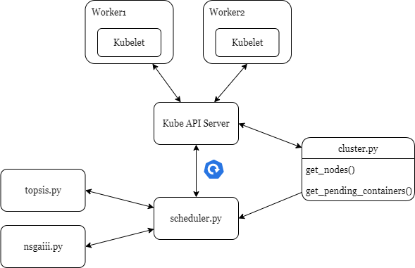

# Kubernetes Hybrid Scheduler

- This scheduler uses the NSGA-III algorithm to select the best nodes on which to place a batch of pods.
- Pods with three or fewer replicas, or those for which NSGA-III cannot find an optimal solution, are scheduled serially using the TOPSIS algorithm.
- `Scheduler.py` follows the Operator pattern to monitor the cluster state and system metrics.
- It relies on metrics-server, Prometheus Node Exporter, and iperf3 for data collection.

### Results:
  - Increased availability, reliability, and scalability of the system
  - Reduced node power consumption and lower communication delay

### Usage:
- Use KIND as a local Kubernetes cluster -> `make buildkind`
- Specify `schedulerName: hybrid-scheduler` and define custom resource requests in pod configurations ([example](kub-objects/nginx-deploy.yaml)).

 

